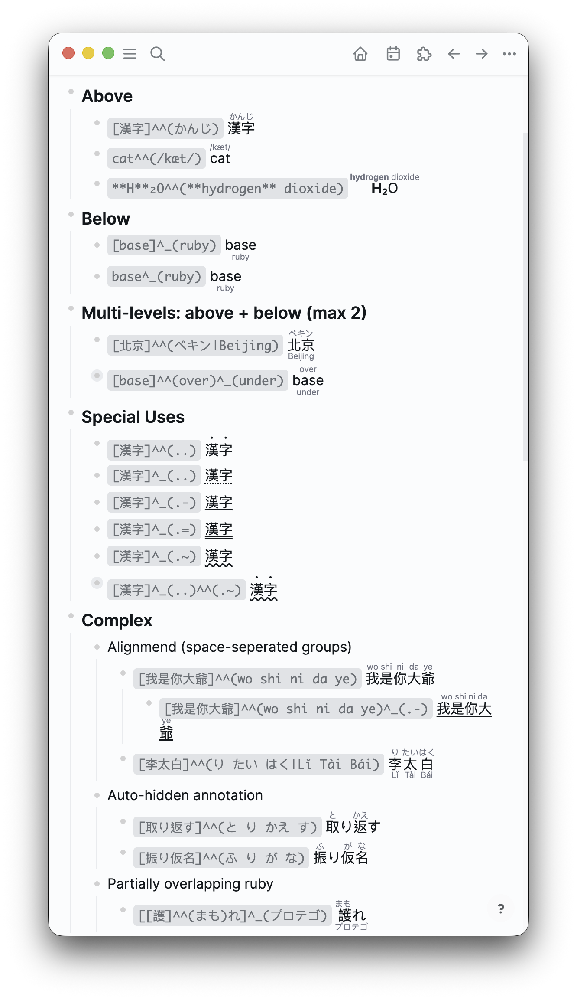

# logseq-furigana-ruby

Logseq plugin for ruby/furigana using the `^^()` syntax from the [Baksi's Markdown Ruby Proposal](https://blog.baksili.codes/markdown-ruby).

## Syntax



### Inline Markup

Supports various ruby annotation styles (see [full showcase](./assets/logseq_test_ruby.md)):

#### Basic Ruby
- `[漢字]^^(かんじ)` or `東京^^(とうきょう)` — annotation above
- `[base]^_(ruby)` — annotation below
- `[北京]^^(ペキン|Beijing)` — two-level annotations (above + below)
- `[base]^^(over)^_(under)` — chained annotations


#### Nested / Partially Overlapping Ruby
- `[[護]^^(まも)れ]^_(プロテゴ)` — inner ruby + outer annotation on a larger span

#### Bouten & Underline
- `[漢字]^^(..)` — bouten (emphasis dots) above
- `[漢字]^_(..)` — dotted underline
- `[base]^_(.-)` — solid underline
- `[base]^_(.~)` — wavy underline
- `[base]^_(.=)` — double underline
- `[漢字]^^(..)^_(..)` — bouten above + underdots below
- `[漢字]^^(..)^_(.-)` — bouten above + solid underline

#### Pipe Equivalence

The pipe syntax `[a]^^(x|y)` is equivalent to the chained syntax `[a]^^(x)^_(y)` — both produce the same output. Use whichever you prefer:

- `[漢字]^^(かんじ|..)` ≡ `[漢字]^^(かんじ)^_(..)` — ruby above + bouten below
- `[漢字]^^(かんじ|.-)` ≡ `[漢字]^^(かんじ)^_(.-)` — ruby above + underline

#### First-Come-Takes-Place

When a pipe already fills both above/below positions, a chained operator is silently consumed. The pipe-separated levels take priority:

- `[李太白]^^(り たい はく|Lǐ Tài Bái)^_(..)` — the `^_(..)` is ignored; pipe already defines above + below.

This avoids ambiguity: each base can have at most two annotation levels (above and below), and the first syntax to claim a position wins.

#### Per-Character Ruby (rendering)
- `[春夏秋冬]^^(はる なつ あき ふゆ)` — auto-aligns each character with its annotation
- `[李太白]^^(り たい はく|Lǐ Tài Bái)` — both levels per-character aligned
- `[振り仮名]^^(ふ り が な)` — identical characters auto-hidden (り→り omitted)

Space-separate annotations to match base characters 1:1. Mismatched counts fall back to group ruby.

### Macro Syntax

Use macros when you need multiple ruby annotations on the same line (avoids Logseq parser conflicts):

```
{{renderer :ruby, 漢字, かんじ}}
{{renderer :ruby, base, annotation, under}}
{{renderer :ruby, 漢字, ..}}
```

## Known Limitations

> Logseq parses its own markdown **before** plugins run, and there is currently [no markdown post‑processor API](https://discuss.logseq.com/t/plugin-api-how-to-modify-the-way-markdown-is-render/17313/5).

- **Multiple inline `^^()` / `^_()`** – conflicts with Logseq’s highlight (`^^text^^`) and italic (`_text_`).  
  Use one ruby per line or convert to macros/HTML with the slash commands.

- **`\|` inside annotations** – Logseq strips the backslash first, so `\|` becomes a bare `|` and is treated as a level separator.  
  Use macros or `&#124;` when you need a literal pipe.

- **Under-bouten downgraded** – `[漢字]^_(..)` and `[漢字]^^(..)^_(..)` render as **underline** or **dots + underline** (instead of true under‑side ruby), because Electron/WebKit clip `ruby-position: under` and `text-emphasis-position: under` in Logseq’s layout. This is a deliberate, semantics‑preserving fallback.

In practice, you can always bypass these issues by converting to **macro** or **HTML** using the slash commands.


## Conversion Commands

Three conversion targets — works on **selected blocks** or current block:

| Command | Description |
|---------|-------------|
| `/Ruby → markup` | Convert HTML / macros → `[base]^^(ann)` syntax |
| `/Ruby → macro` | Convert markup / HTML → `{{renderer :ruby, …}}` |
| `/Ruby → HTML` | Convert markup / macros → raw `<ruby>` HTML (**one-way** — per-character alignment and auto-hide are baked in) |

## Install

1. Download/clone this repo
2. Logseq: **Settings → Advanced → Developer mode**
3. **Plugins → Load unpacked plugin** → select this folder

## Development

```bash
pnpm install
pnpm dev      # HMR
pnpm test     # vitest
pnpm build    # dist/
```

## License

MIT — Baksi Li <<myself@baksili.codes>>
