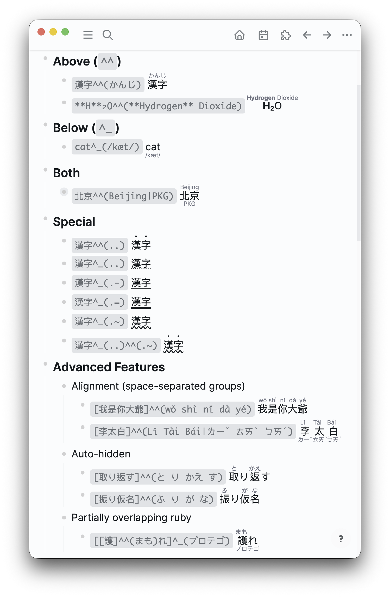

# logseq-furigana-ruby

Logseq plugin for inline annotation using the `^^()`/`^_()` syntax.

> A markdown-it plugin and VS Code extension are planned.
> Checkout [Baksi's Proposal](https://blog.baksili.codes/markdown-ruby).

## Basic Syntax



📖 **[Full showcase](./assets/logseq_inline_annotation.md)** — Example annotations; open in Logseq with the plugin for live rendering.

### Inline Markup

Supports various ruby annotation styles:

#### Basic Ruby
- `[base]^^(ruby)` – annotation above
    > <ruby class="ls-ruby ls-ruby-over">base<rp>(</rp><rt>ruby</rt><rp>)</rp></ruby>
- `[base]^_(ruby)` — annotation below
    > <ruby class="ls-ruby ls-ruby-under">base<rp>(</rp><rt>ruby</rt><rp>)</rp></ruby>
- `[北京]^^(ペキン|Beijing)` — annotation two-level (above + below)
    > <ruby class="ls-ruby ls-ruby-under ls-ruby-double"><ruby class="ls-ruby ls-ruby-over">北京<rp>(</rp><rt>ペキン</rt><rp>)</rp></ruby><rp>(</rp><rt>Beijing</rt><rp>)</rp></ruby>

N.B. `base^^(ruby)` – `[]` can be ommitted.

#### Per-Character Ruby (rendering)
- `[春夏秋冬]^^(はる なつ あき ふゆ)` — auto-aligns each character with its annotation
    > <ruby class="ls-ruby ls-ruby-over">春<rp>(</rp><rt>はる</rt><rp>)</rp></ruby><ruby class="ls-ruby ls-ruby-over">夏<rp>(</rp><rt>なつ</rt><rp>)</rp></ruby><ruby class="ls-ruby ls-ruby-over">秋<rp>(</rp><rt>あき</rt><rp>)</rp></ruby><ruby class="ls-ruby ls-ruby-over">冬<rp>(</rp><rt>ふゆ</rt><rp>)</rp></ruby>
- `[振り仮名]^^(ふ り が な)` — identical characters auto-hidden (り→り omitted)
    > <ruby class="ls-ruby ls-ruby-over">振<rp>(</rp><rt>ふ</rt><rp>)</rp></ruby><ruby class="ls-ruby ls-ruby-over">り<rp>(</rp><rt></rt><rp>)</rp></ruby><ruby class="ls-ruby ls-ruby-over">仮<rp>(</rp><rt>が</rt><rp>)</rp></ruby><ruby class="ls-ruby ls-ruby-over">名<rp>(</rp><rt>な</rt><rp>)</rp></ruby>

#### Nested / Partially Overlapping Ruby
- `[base]^^(over)^_(under)` — chained annotations
    > <ruby class="ls-ruby ls-ruby-under ls-ruby-double" style="ruby-position:under"><ruby class="ls-ruby ls-ruby-over">base<rp>(</rp><rt>over</rt><rp>)</rp></ruby><rp>(</rp><rt>under</rt><rp>)</rp></ruby>
- `[[護]^^(まも)れ]^_(プロテゴ)` — inner ruby + outer annotation on a larger span
    > <ruby class="ls-ruby ls-ruby-under" style="ruby-position:under"><ruby class="ls-ruby ls-ruby-over">護<rp>(</rp><rt>まも</rt><rp>)</rp></ruby>れ<rp>(</rp><rt>プロテゴ</rt><rp>)</rp></ruby>

#### Bouten & Underline
- `base^^(..)` — bouten (emphasis dots) above
    > <span class="ls-ruby-bouten ls-ruby-bouten-over" style="text-emphasis:filled dot;-webkit-text-emphasis:filled dot;text-emphasis-position:over right;-webkit-text-emphasis-position:over right">base</span>
- `base^_(..)` — dotted underline
    > <span class="ls-ruby-bouten ls-ruby-bouten-under" style="text-decoration:underline dotted;text-underline-offset:0.15em">base</span>
- `base^_(.-)` — solid underline
    > <span class="ls-ruby-underline" style="text-decoration-line:underline;text-underline-offset:0.15em">base</span>
- `base^_(.=)` — double underline
    > <span class="ls-ruby-underline ls-ruby-underline-double" style="text-decoration-line:underline;text-underline-offset:0.15em;text-decoration-style:double">base</span>
- `base^_(.~)` — wavy underline
    > <span class="ls-ruby-underline ls-ruby-underline-wavy" style="text-decoration-line:underline;text-underline-offset:0.15em;text-decoration-style:wavy">base</span>
- `base^^(..)^_(..)` — two-levels
    > <span class="ls-ruby-bouten ls-ruby-bouten-over ls-ruby-bouten-under" style="text-emphasis:filled dot;-webkit-text-emphasis:filled dot;text-emphasis-position:over right;-webkit-text-emphasis-position:over right;text-decoration:underline dotted;text-underline-offset:0.15em">base</span>

### Macro Syntax (Logseq)

Use macros when you need multiple ruby annotations on the same line (avoids Logseq parser conflicts):

```
{{renderer :ruby, 漢字, かんじ}}
{{renderer :ruby, base, annotation, under}}
{{renderer :ruby, 漢字, ..}}
```

## Use Cases

While the syntax originates from CJK furigana, it supports any interlinear annotation.
Here are some interesting use cases:

**Furigana / phonetic guides**
- `[取り返す]^^(と り かえ す)` – Japanese kanji → hiragana
    > <ruby class="ls-ruby ls-ruby-over">取<rp>(</rp><rt>と</rt><rp>)</rp></ruby><ruby class="ls-ruby ls-ruby-over">り<rp>(</rp><rt></rt><rp>)</rp></ruby><ruby class="ls-ruby ls-ruby-over">返<rp>(</rp><rt>かえ</rt><rp>)</rp></ruby><ruby class="ls-ruby ls-ruby-over">す<rp>(</rp><rt></rt><rp>)</rp></ruby>
- `[李太白]^^(Lǐ Tài Bái|ㄌㄧˇ ㄊㄞˋ ㄅㄞˊ)` — Chinese characters → pinyin/bopomofo
    > <ruby class="ls-ruby ls-ruby-under ls-ruby-double" style="ruby-position:under"><ruby class="ls-ruby ls-ruby-over">李<rp>(</rp><rt>Lǐ</rt><rp>)</rp></ruby><rp>(</rp><rt>ㄌㄧˇ</rt><rp>)</rp></ruby><ruby class="ls-ruby ls-ruby-under ls-ruby-double" style="ruby-position:under"><ruby class="ls-ruby ls-ruby-over">太<rp>(</rp><rt>Tài</rt><rp>)</rp></ruby><rp>(</rp><rt>ㄊㄞˋ</rt><rp>)</rp></ruby><ruby class="ls-ruby ls-ruby-under ls-ruby-double" style="ruby-position:under"><ruby class="ls-ruby ls-ruby-over">白<rp>(</rp><rt>Bái</rt><rp>)</rp></ruby><rp>(</rp><rt>ㄅㄞˊ</rt><rp>)</rp></ruby>

N.B. Characters can be auto-aligned.
Space-separate annotations to match base characters 1:1. Mismatched counts fall back to group ruby.

**Translations**
- `cat^^(chat|猫)` — English → French (over) + Chinese (under)
    > <ruby class="ls-ruby ls-ruby-under ls-ruby-double" style="ruby-position:under"><ruby class="ls-ruby ls-ruby-over">cat<rp>(</rp><rt>chat</rt><rp>)</rp></ruby><rp>(</rp><rt>猫</rt><rp>)</rp></ruby>
- `貓^^(猫)` — Traditional Chinese → Simplified Chinese
    > <ruby class="ls-ruby ls-ruby-over">貓<rp>(</rp><rt>猫</rt><rp>)</rp></ruby>

**Transcription / transliteration**
- `猫^^(ねこ|neko)` — kanji → hiragana (over) + romaji (under)
    > <ruby class="ls-ruby ls-ruby-under ls-ruby-double" style="ruby-position:under"><ruby class="ls-ruby ls-ruby-over">猫<rp>(</rp><rt>ねこ</rt><rp>)</rp></ruby><rp>(</rp><rt>neko</rt><rp>)</rp></ruby>
- `貓^^(māo|cat)` — Chinese → pinyin (over) + English (under)
    > <ruby class="ls-ruby ls-ruby-under ls-ruby-double" style="ruby-position:under"><ruby class="ls-ruby ls-ruby-over">貓<rp>(</rp><rt>māo</rt><rp>)</rp></ruby><rp>(</rp><rt>cat</rt><rp>)</rp></ruby>
- `Москва^^(Moskva)` — Cyrillic → Latin
    > <ruby class="ls-ruby ls-ruby-over">Москва<rp>(</rp><rt>Moskva</rt><rp>)</rp></ruby>
- `cat^^(/kæt/)` — IPA transcription
    > <ruby class="ls-ruby ls-ruby-over">cat<rp>(</rp><rt>/kæt/</rt><rp>)</rp></ruby>

**Emphasis / study aids**
- `重要^^(..)` — bouten dots for emphasis
    > <span class="ls-ruby-bouten ls-ruby-bouten-over" style="text-emphasis:filled dot;-webkit-text-emphasis:filled dot;text-emphasis-position:over right;-webkit-text-emphasis-position:over right">重要</span>
- `重要語句^^(じゅうようごく|.-)` — furigana above + underline for vocabulary study
    > <ruby class="ls-ruby ls-ruby-mixed ls-ruby-over ls-ruby-underline" style="text-decoration-line:underline;text-underline-offset:0.15em">重要語句<rp>(</rp><rt>じゅうようごく</rt><rp>)</rp></ruby>

**Title**
- `[初音ミク^^(偉大なる|世界一姫様)]^_(Vocaloid)` – pile up titles around a name
    > <ruby class="ls-ruby ls-ruby-under" style="ruby-position:under"><ruby class="ls-ruby ls-ruby-under ls-ruby-double" style="ruby-position:under"><ruby class="ls-ruby ls-ruby-over">初音ミク<rp>(</rp><rt>偉大なる</rt><rp>)</rp></ruby><rp>(</rp><rt>世界一姫様</rt><rp>)</rp></ruby><rp>(</rp><rt>Vocaloid</rt><rp>)</rp></ruby>

## Conversion Commands

Three conversion targets — works on **selected blocks** or current block:

| Command | Description |
|---------|-------------|
| `/Ruby → markup` | Convert HTML / macros → `[base]^^(ann)` syntax |
| `/Ruby → macro` | Convert markup / HTML → `{{renderer :ruby, …}}` |
| `/Ruby → HTML` | Convert markup / macros → raw `<ruby>` HTML (**one-way** — per-character alignment and auto-hide are baked in) |

## Known Limitations (Logseq)

> Logseq parses its own markdown **before** plugins run, and there is currently [no markdown post‑processor API](https://discuss.logseq.com/t/plugin-api-how-to-modify-the-way-markdown-is-render/17313/5).

- **Multiple inline `^^()` / `^_()`** – conflicts with Logseq’s highlight (`^^text^^`) and italic (`_text_`).  

- **`\|` inside annotations** – Logseq strips the backslash first, so `\|` becomes a bare `|` and is treated as a level separator.  

In practice, you can always bypass these issues by either using `\^\^` escape letters, or converting to **macro** or **HTML** using the slash commands.

## Install (Manual)

1. Download/clone this repo and run `pnpm build`
2. In Logseq, **Settings → Advanced → Developer mode**
3. Then install, **Plugins → Load unpacked plugin** → select this folder

## Development

```bash
pnpm install
pnpm dev      # HMR
pnpm test     # vitest
pnpm build    # dist/
```

## Appendix: Operator Properties

`^^` and `^_` are **position-assignment operators** on a 2-slot system (over / under).
Special patterns (`..`, `.-`, `.~`, `.=`) act as **rendering modifiers** — they change a slot from ruby annotation to CSS decoration (bouten, underline).

**Commutativity** — chain order doesn’t matter; position is determined by the operator:
- `[a]^^(x)^_(y)` ≡ `[a]^_(y)^^(x)`

**Pipe equivalence** — pipe is compact notation for cross-operator chaining:
- `[a]^^(x|y)` ≡ `[a]^^(x)^_(y)` ≡ `[a]^_(y)^^(x)`
- `[漢字]^^(かんじ|.-)` ≡ `[漢字]^^(かんじ)^_(.-)` — ruby above + underline

**Idempotency of position** — same-operator chaining is rejected (each slot claimed once):
- `[a]^^(x)^^(y)` — NOT chained; two separate expressions

**First-come-takes-place** — when pipe saturates both slots, a chained operator is silently consumed:
- `[李太白]^^(り たい はく|Lǐ Tài Bái)^_(..)` — `^_(..)` ignored; pipe already fills both

**Capacity** — max 2 levels (over + under) per base.

## License

MIT — Baksi Li <<myself@baksili.codes>>
